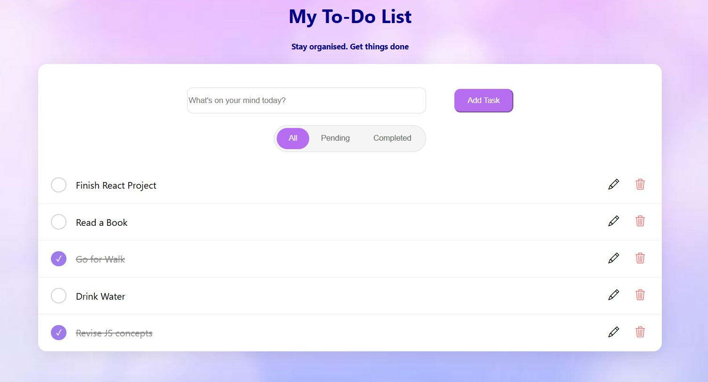
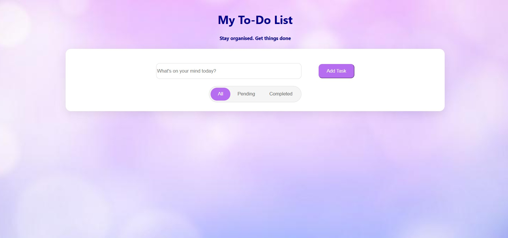
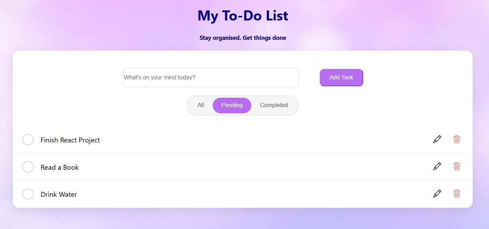
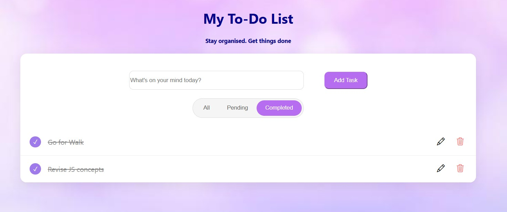

# React Todo App

A modern and responsive Todo List application built using React.js. This app helps users manage daily tasks efficiently with features like adding, editing, deleting, completing, and filtering tasks.

## Features

- Add new tasks
- Edit existing tasks
- Delete tasks
- Mark tasks as completed
- Filter tasks by:
  - All
  - Pending
  - Completed
- Responsive and modern UI
- Interactive task management

## Screenshots

### Main 

### Home Page

### Pending Tasks

### Completed Tasks

## Built With

- React.js
- JavaScript 
- HTML5
- CSS3
- Bootstrap Icons

## Installation
1. Clone the repository
git clone https://github.com/amrita-0403/TodoApp-react-
 
2. Navigate to the project folder
cd todo-app
 
3. Install dependencies
npm install
  
4. Start the development server
npm start
 
The application will run on:
http://localhost:3000
  

## Functionality

- Enter a task in the input field.
- Click **Add** to create a task.
- Use the checkbox to mark tasks as completed.
- Click the edit icon to update a task.
- Click the delete icon to remove a task.
- Filter tasks using the **All**, **Pending**, and **Completed** tabs.

##  Future Improvements

- Local Storage support
- Dark Mode
- Due Dates and Reminders
- Task Categories
- Drag and Drop Reordering
- Backend Integration

##  Author
Amrita Patnaik

